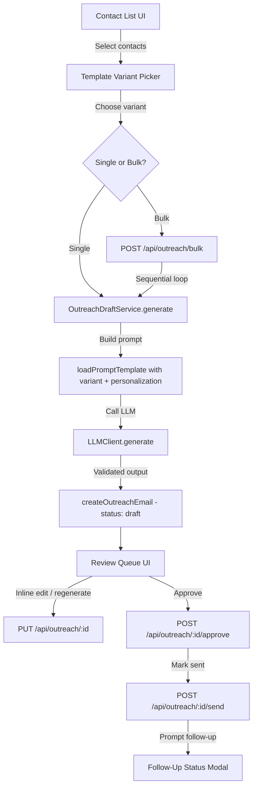

# Design Document: Personalized Outreach Drafting

## Overview

This feature extends the existing outreach draft pipeline to support highly personalized, variant-aware email generation with bulk operations and an improved inline review experience. The system follows a clear flow: **contact selection → variant choice → draft generation → inline review/edit → approve → send**.

Key design goals:
- Extend the `Contact` model with personalization fields without breaking existing queries
- Introduce template variants as a simple constants-driven system (no new DB table)
- Reuse the existing `OutreachDraftService` / `LLMClient` architecture — add variant and personalization awareness
- Keep bulk generation sequential and capped to avoid LLM rate-limit issues
- Store variant preferences in `localStorage` (client-only, per platform_source)
- Preserve the existing state machine (draft → approved → sent) with no auto-send path

## Architecture



### Data Flow Summary

1. User picks one or more contacts from the contact list
2. User selects a template variant (defaulted from localStorage preference for that platform_source)
3. System calls the generation endpoint (single or bulk)
4. `OutreachDraftService` builds a prompt using: variant rules + contact personalization fields + resume highlights
5. LLM returns JSON `{ subject, body }` → validated by Zod schema
6. Email record is created with `status: "draft"`
7. User reviews in the inline queue — can edit body, regenerate, approve, or reject
8. Approved emails can be explicitly sent; system prompts for follow-up status

## Components and Interfaces

### 1. Template Variants Constants

A new file `src/lib/constants/template-variants.ts` defines available variants and their prompt rules:

```typescript
export interface TemplateVariant {
  id: string;
  label: string;
  toneRules: string;  // Injected into the prompt template
  structureNotes: string;
}

export const TEMPLATE_VARIANTS: TemplateVariant[] = [
  {
    id: "founder_cold",
    label: "Founder cold outreach",
    toneRules: "Direct, confident, peer-to-peer. No flattery. Lead with what you build.",
    structureNotes: "Hook referencing their product → your relevant project → low-friction ask (15-min chat or async question).",
  },
  {
    id: "warm_referral",
    label: "Warm/referral intro",
    toneRules: "Friendly, casual, reference the mutual connection or warm context upfront.",
    structureNotes: "Mutual connection mention → brief context on your work → ask for intro or quick call.",
  },
  {
    id: "job_posting_followup",
    label: "Job-posting follow-up",
    toneRules: "Professional, concise. Reference the specific role posting. Show you've done homework.",
    structureNotes: "Reference the role → 1 matching highlight → ask about process or next steps.",
  },
  {
    id: "alumni_network",
    label: "Alumni/network ask",
    toneRules: "Warm, respectful of their time. Reference shared background (school, community, event).",
    structureNotes: "Shared context → brief about your search → ask for advice or 15-min informational chat.",
  },
];

export const DEFAULT_VARIANT_ID = "founder_cold";

export function getVariantById(id: string): TemplateVariant | undefined {
  return TEMPLATE_VARIANTS.find((v) => v.id === id);
}
```

### 2. Extended Contact Schema

Update `src/lib/validation/schemas.ts` to add the three new fields:

```typescript
export const contactCreateSchema = z.object({
  name: z.string().min(1, "Name is required"),
  company_name: z.string().optional().nullable(),
  role_title: z.string().optional().nullable(),
  email: z.string().email().optional().nullable().or(z.literal("")),
  linkedin_url: z.string().url().optional().nullable().or(z.literal("")),
  status: z.enum(CONTACT_STATUSES).optional(),
  application_id: z.string().uuid().optional().nullable(),
  // New personalization fields
  company_one_liner: z.string().max(200).optional().nullable(),
  personalization_hook: z.string().max(500).optional().nullable(),
  platform_source: z.string().max(100).optional().nullable(),
});
```

### 3. Extended OutreachDraftService

The existing `OutreachDraftService` gains:
- A `variantId` parameter (defaults to `"founder_cold"`)
- Inclusion of personalization fields (`company_one_liner`, `personalization_hook`) in the prompt
- A new prompt template structure with variant-specific tone injection

```typescript
interface OutreachDraftServiceDeps {
  db: Database.Database;
  userId: string;
  regenerationNote?: string;
  variantId?: string;       // NEW
  llmClient?: Pick<LLMClient, "generate">;
}
```

The `generate()` method changes:
1. Read the contact's `company_one_liner` and `personalization_hook`
2. Look up the `TemplateVariant` by `variantId`
3. Pass both to `loadPromptTemplate` with new placeholders

### 4. Updated Prompt Template

The prompt file `prompts/outreach_draft.md` is updated to include variant rules and personalization fields:

```markdown
# Outreach Email Draft

You are drafting a short, personalized outreach email for a job search.

## Tone & Structure (variant: {{variant_label}})

{{variant_tone_rules}}

Structure: {{variant_structure_notes}}

## Rules

- Keep the email body to 120 words or fewer.
- Opening 1-2 sentences MUST reference the company one-liner and personalization hook if provided.
- Highlight 1-2 relevant resume bullets — do not invent experience.
- Include a clear, low-friction ask.
- Do not claim you already applied unless application context says so.
- Return JSON with `subject` and `body` only.

## Contact

- Name: {{contact_name}}
- Role: {{contact_role}}
- Company: {{contact_company}}
- Company one-liner: {{company_one_liner}}
- Personalization hook: {{personalization_hook}}

## Application context

{{application_context}}

## Relevant resume highlights

{{resume_highlights}}

{{regeneration_note}}

Draft the email.
```

### 5. Bulk Generation Endpoint

New endpoint: `POST /api/outreach/bulk`

```typescript
// Request schema
export const outreachBulkGenerateRequestSchema = z.object({
  contactIds: z.array(z.string().uuid()).min(1).max(20),
  variantId: z.string().optional(),
});
```

The handler iterates over `contactIds` sequentially, calling `OutreachDraftService.generate()` for each. It returns a results array with per-contact success/failure status.

### 6. Updated Single Generate Endpoint

The existing `POST /api/outreach` request schema is extended:

```typescript
export const outreachGenerateRequestSchema = z.object({
  contactId: z.string().uuid(),
  regenerationNote: z.string().optional(),
  variantId: z.string().optional(),  // NEW
});
```

### 7. UI Components

| Component | Location | Purpose |
|-----------|----------|---------|
| `VariantPicker` | `src/components/outreach/VariantPicker.tsx` | Dropdown for selecting template variant; reads/writes localStorage preference per platform_source |
| `DraftReviewCard` | `src/components/outreach/DraftReviewCard.tsx` | Inline editable card with textarea, word counter, regenerate/approve/reject buttons |
| `WordCounter` | `src/components/outreach/WordCounter.tsx` | Displays live word count and character count |
| `BulkGenerateBar` | `src/components/outreach/BulkGenerateBar.tsx` | Toolbar with select-all checkbox, count badge, "Generate drafts for selected" button, progress indicator |
| `FollowUpPrompt` | `src/components/outreach/FollowUpPrompt.tsx` | Modal displayed after marking an email as sent; prompts user to set followup_status on associated application |

### 8. Variant Preference Storage (Client-side)

```typescript
// src/lib/utils/variant-preferences.ts
const STORAGE_KEY = "outreach_variant_prefs";

export function getVariantForPlatform(platformSource: string): string | null {
  const prefs = JSON.parse(localStorage.getItem(STORAGE_KEY) ?? "{}");
  return prefs[platformSource] ?? null;
}

export function setVariantForPlatform(platformSource: string, variantId: string): void {
  const prefs = JSON.parse(localStorage.getItem(STORAGE_KEY) ?? "{}");
  prefs[platformSource] = variantId;
  localStorage.setItem(STORAGE_KEY, JSON.stringify(prefs));
}
```

## Data Models

### Contact Table Changes

Three new nullable columns added to the `contacts` table:

```sql
ALTER TABLE contacts ADD COLUMN company_one_liner TEXT;
ALTER TABLE contacts ADD COLUMN personalization_hook TEXT;
ALTER TABLE contacts ADD COLUMN platform_source TEXT;
```

These are added via the existing migration pattern in `src/lib/db/sqlite.ts`:

```typescript
// In initializeSchema, after existing ALTER TABLE checks
const contactCols = db.prepare("PRAGMA table_info(contacts)").all() as Array<{ name: string }>;
const contactColNames = new Set(contactCols.map((c) => c.name));
if (!contactColNames.has("company_one_liner")) {
  db.exec("ALTER TABLE contacts ADD COLUMN company_one_liner TEXT");
}
if (!contactColNames.has("personalization_hook")) {
  db.exec("ALTER TABLE contacts ADD COLUMN personalization_hook TEXT");
}
if (!contactColNames.has("platform_source")) {
  db.exec("ALTER TABLE contacts ADD COLUMN platform_source TEXT");
}
```

### Updated Contact Type

```typescript
export interface Contact {
  id: string;
  user_id: string;
  application_id: string | null;
  name: string;
  company_name: string | null;
  role_title: string | null;
  email: string | null;
  linkedin_url: string | null;
  company_one_liner: string | null;       // NEW
  personalization_hook: string | null;    // NEW
  platform_source: string | null;         // NEW
  status: ContactStatus;
  created_at: string;
  updated_at: string;
}
```

### Outreach Email Table (Unchanged)

The `outreach_emails` table schema remains unchanged. The `status` state machine is preserved as-is:
- `draft` → `approved` | `rejected`
- `approved` → `sent`
- `rejected` → `draft`
- `sent` → (terminal)

### Variant Preference Storage

No database table — stored in browser `localStorage` as a simple JSON map:

```json
{
  "LinkedIn": "founder_cold",
  "Referral": "warm_referral",
  "Company Site": "job_posting_followup"
}
```

## Correctness Properties

*A property is a characteristic or behavior that should hold true across all valid executions of a system — essentially, a formal statement about what the system should do. Properties serve as the bridge between human-readable specifications and machine-verifiable correctness guarantees.*

### Property 1: Contact personalization field length validation

*For any* string input to `company_one_liner` or `personalization_hook`, strings within the defined max length (200 and 500 chars respectively) SHALL be accepted by the schema, and strings exceeding the max length SHALL be rejected.

**Validates: Requirements 1.1, 1.2**

### Property 2: Contact field persistence round-trip

*For any* valid contact input containing `company_one_liner`, `personalization_hook`, and `platform_source` values, creating or updating the contact and then retrieving it SHALL return the same values for all three fields.

**Validates: Requirements 1.4**

### Property 3: Prompt construction includes all personalization data and variant rules

*For any* contact with non-null personalization fields and *for any* template variant, the prompt string constructed by the `OutreachDraftService` SHALL contain the `company_one_liner`, `personalization_hook`, and the variant's `toneRules` and `structureNotes`.

**Validates: Requirements 2.1, 2.2, 2.7, 3.2**

### Property 4: Graceful generation with missing personalization fields

*For any* contact where `company_one_liner` and `personalization_hook` are both null, the `OutreachDraftService.generate()` method SHALL produce a valid prompt without throwing an error.

**Validates: Requirements 2.6**

### Property 5: Highlight retrieval returns results ordered by relevance score

*For any* resume content and contact context, the highlights returned by `retrieveRelevantHighlights` SHALL be ordered in non-increasing score order, and each returned highlight SHALL have a positive overlap score when the query context is non-empty.

**Validates: Requirements 2.3**

### Property 6: Variant preference round-trip

*For any* platform source string and variant ID, calling `setVariantForPlatform` then `getVariantForPlatform` with the same platform source SHALL return the stored variant ID.

**Validates: Requirements 3.3**

### Property 7: Word and character count accuracy

*For any* non-empty string, the word count function SHALL return a count equal to splitting by whitespace and filtering empty tokens, and the character count SHALL equal the string length.

**Validates: Requirements 4.2**

### Property 8: Draft edit persistence round-trip

*For any* outreach email in "draft" status and *for any* valid non-empty body string, calling `updateOutreachDraftContent` with that body and then retrieving the email SHALL return the updated body.

**Validates: Requirements 4.5**

### Property 9: Bulk generation produces one draft per contact

*For any* set of N valid contact IDs where 1 ≤ N ≤ 20, bulk draft generation SHALL produce exactly N outreach email records, each with status "draft".

**Validates: Requirements 5.3**

### Property 10: Bulk generation rejects requests exceeding 20 contacts

*For any* list of contact IDs with length > 20, the bulk generation request SHALL be rejected with a validation error.

**Validates: Requirements 5.4**

### Property 11: Outreach email state machine enforcement

*For any* outreach email, the only valid status transitions are: draft→approved, draft→rejected, approved→sent, rejected→draft. Any other transition (e.g., draft→sent, sent→draft) SHALL be rejected.

**Validates: Requirements 6.1, 6.4, 7.1, 7.2**

### Property 12: Draft generator always produces draft status

*For any* contact ID and variant ID input to `OutreachDraftService.generate()`, the resulting outreach email record SHALL have status "draft" and never "approved" or "sent".

**Validates: Requirements 7.3**

## Error Handling

| Scenario | Handling |
|----------|----------|
| Contact not found during generation | Return 404 JSON error |
| LLM output fails Zod validation after retries | Return 422 with `status: "needs_review"` and validation errors; no email record is created |
| No base resume uploaded | Generation proceeds with empty highlights section; prompt instructs LLM to use general professional tone |
| Bulk generation: one contact fails | Continue processing remaining contacts; return partial results array with per-contact status |
| Bulk generation: > 20 contacts | Return 400 immediately with descriptive error message before processing any |
| Invalid variant ID | Fall back to `DEFAULT_VARIANT_ID` ("founder_cold") and proceed |
| Invalid status transition (e.g., draft → sent) | Throw error from `canTransition` check; API returns 400 |
| Database write failure | Let SQLite error propagate; API returns 500 with generic error message |
| Empty draft body on save | Schema validation rejects (body min length 1); return 400 |

## Testing Strategy

### Unit Tests (Example-Based)

- Contact form renders new fields (1.5)
- Template variant dropdown contains all 4 options (3.1)
- Default variant is "Founder cold outreach" when no preference exists (3.4)
- Regenerate button triggers re-generation (4.3, 4.4)
- Bulk generate button enable/disable states (5.2)
- Progress indicator shows during bulk generation (5.7)
- Follow-up prompt displays after send (6.2)
- Sent emails move to "Sent" section (6.3)

### Property-Based Tests

Property-based testing is appropriate for this feature because it contains pure validation functions, deterministic prompt construction, round-trip persistence logic, and state machine enforcement — all areas where input variation reveals edge cases.

**Library:** [fast-check](https://github.com/dubzzz/fast-check) (JavaScript/TypeScript PBT library)

**Configuration:**
- Minimum 100 iterations per property test
- Each test tagged with: `Feature: personalized-outreach-drafting, Property {N}: {title}`

| Property | Test Target | Generators |
|----------|------------|------------|
| P1: Field length validation | Zod schema validation | Random strings from 0 to 600 chars |
| P2: Contact persistence round-trip | `createContact` / `getContact` | Random valid contact objects with all fields |
| P3: Prompt includes personalization + variant | `OutreachDraftService` prompt builder (with mock LLM) | Random contact fields × 4 variant IDs |
| P4: Graceful fallback | `OutreachDraftService` prompt builder (with mock LLM) | Contacts with null personalization fields |
| P5: Highlight ordering | `retrieveRelevantHighlights` | Random resume content + random context strings |
| P6: Variant preference round-trip | `setVariantForPlatform` / `getVariantForPlatform` | Random platform strings × random variant IDs |
| P7: Word/char count | `countWords` / `countChars` utility | Random strings including empty, whitespace-heavy, unicode |
| P8: Draft edit round-trip | `updateOutreachDraftContent` / `getOutreachEmail` | Random non-empty body strings |
| P9: Bulk produces N drafts | Bulk endpoint handler (with mock LLM) | Random subsets of 1-20 contact IDs |
| P10: Bulk rejects > 20 | Zod schema validation | Arrays of 21-100 UUIDs |
| P11: State machine | `canTransition` / transition functions | All status pairs (cartesian product) |
| P12: Generator produces draft | `createOutreachEmail` called by service | Random contact + variant inputs |

### Integration Tests

- End-to-end single draft generation via API (POST /api/outreach)
- End-to-end bulk generation via API (POST /api/outreach/bulk)
- Full approve → send → follow-up prompt flow
- Contact CRUD with new fields via API
